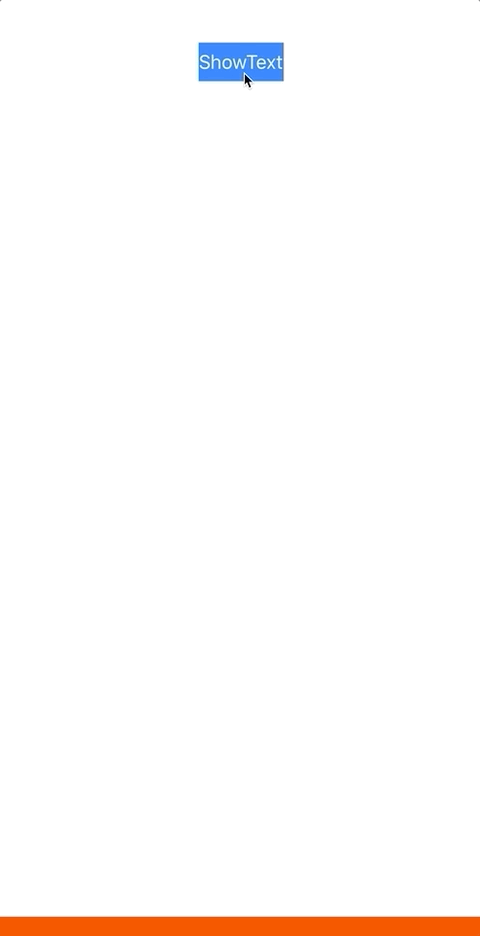
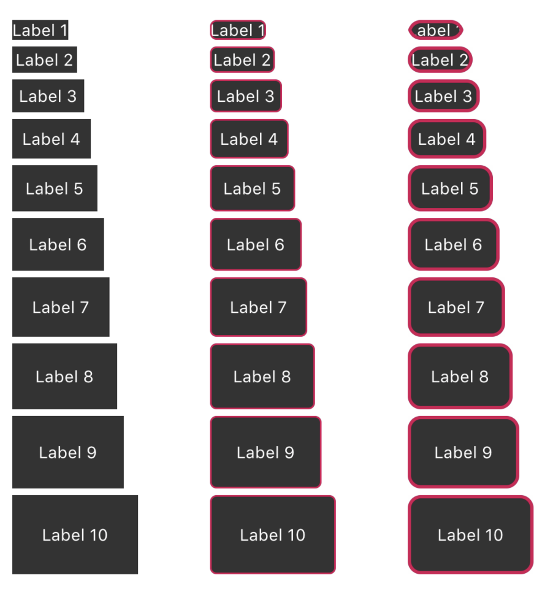

# MessageUISample
Show short message on screen test project.

# Timer hide label.

# UILabel with padding.

This project includes a custom UILabel class that can add rounded corners, borders, and margins.

- This is done by overriding UILabel's drawText.

- Override intrinsicContentSize and return the correct rectangle for use in Storyboard.

- Override sizeThatFits to return the correct rectangle so that it works correctly when using sizeToFit in code.

-  It not worked when `lineBreakMode=.byCharWrapping` .
